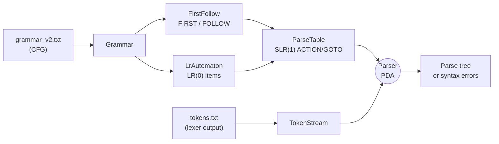

# LR Parser — SLR(1) Deterministic Pushdown Automaton

A table-driven **SLR(1) parser** for a simplified object-oriented language, implemented from
scratch in C++17 as a deterministic pushdown automaton (DPDA). The parser reads a grammar file
and a token file, builds the LR(0) item automaton and SLR(1) ACTION/GOTO tables at run time,
then parses the token stream — emitting a full parse tree for valid input, or line/column-tagged
syntax errors with panic-mode recovery for invalid input.

No parser generator, no third-party libraries — everything from the FIRST/FOLLOW closure to the
shift/reduce driver is implemented directly against the C++ standard library.

---

## Contents

- [Overview](#overview)
- [How it works](#how-it-works)
- [Repository layout](#repository-layout)
- [Requirements](#requirements)
- [Build](#build)
- [Usage](#usage)
- [Output format](#output-format)
- [Grammar file format](#grammar-file-format)
- [Token file format](#token-file-format)
- [Generated tables](#generated-tables)
- [Error reporting and recovery](#error-reporting-and-recovery)
- [Test suite](#test-suite)
- [Performance](#performance)
- [Design notes](#design-notes)
- [Known limitations](#known-limitations)
- [Project context](#project-context)

---

## Overview

The program implements the classic bottom-up parsing pipeline end to end:

| Stage | Component | Responsibility |
|-------|-----------|----------------|
| 1 | `Grammar` | Parse the grammar file into productions; classify terminals vs non-terminals |
| 2 | `FirstFollow` | Fixed-point computation of FIRST and FOLLOW sets (ε-aware) |
| 3 | `LrAutomaton` | Canonical collection of LR(0) items via CLOSURE / GOTO — the PDA state graph |
| 4 | `ParseTable` | SLR(1) ACTION and GOTO tables, with conflict detection and resolution |
| 5 | `Parser` | Shift/reduce driver over a dual state + node stack; builds the parse tree |
| 6 | `ErrorReporter` | Collects and prints positioned syntax errors |

The parser is the second stage of a two-stage front end: a companion lexer produces the token
file that this program consumes, so the two together form a complete `source → tokens → parse tree`
front end.



---

## How it works

**Table construction (one-time, per grammar).**
The grammar is augmented with `S' -> S`, and state 0 is seeded with `CLOSURE({S' -> . S})`.
The canonical collection is then grown by repeatedly applying `GOTO(I, X)` for every state `I`
and every grammar symbol `X`, adding each new item set as a state. Transitions on non-terminals
become GOTO entries; transitions on terminals become `shift` actions. For every complete item
`A -> α .` in a state, a `reduce` action is written for each terminal in `FOLLOW(A)` — the SLR(1)
lookahead rule. The item `S' -> S .` yields `accept` on `$`.

**Parsing (the DPDA).**
The parser maintains two parallel stacks — `stateStack_` (the automaton configuration) and
`nodeStack_` (partial parse trees) — and drives them from the ACTION table:

- **shift** — push the target state, push a `TerminalNode`, advance the input
- **reduce** — pop `|RHS|` entries off both stacks, collect the popped nodes as children of a new
  `RuleNode`, then push `GOTO(exposed_state, LHS)`
- **accept** — the remaining node is the root of the parse tree
- **error** — report position, attempt panic-mode recovery, continue

Because the ACTION/GOTO tables are deterministic, every input is decided in a single left-to-right
pass with no backtracking.

---

## Repository layout

```
assignment_2/
├── CMakeLists.txt              # C++17, strict warnings, -Os release, optional ASan
├── grammar/
│   ├── grammar_v1.txt          # Minimal expression grammar (smoke-test CFG)
│   └── grammar_v2.txt          # Full OO language CFG — 75 productions
├── src/
│   ├── main.cpp                # CLI entry point, stage wiring, timing instrumentation
│   ├── Grammar.{h,cpp}         # Grammar file loader and symbol classification
│   ├── Production.h            # Production / GrammarSymbol value types
│   ├── FirstFollow.{h,cpp}     # FIRST and FOLLOW fixed-point computation
│   ├── LrAutomaton.{h,cpp}     # LR(0) item sets, CLOSURE, GOTO, state graph
│   ├── ParseTable.{h,cpp}      # SLR(1) ACTION/GOTO tables + conflict handling
│   ├── Parser.{h,cpp}          # Shift/reduce PDA driver and panic-mode recovery
│   ├── ParseNode.{h,cpp}       # Abstract tree node, higher-order forEach traversal
│   ├── RuleNode.{h,cpp}        # Internal node — a reduced production
│   ├── TerminalNode.{h,cpp}    # Leaf node — a consumed token
│   ├── Token.h                 # Token type enum and record
│   ├── TokenStream.{h,cpp}     # Lexer-output reader, peek/advance cursor
│   └── ErrorReporter.{h,cpp}   # Positioned syntax-error collection
└── tests/
    ├── inputs/                 # 24 token-stream fixtures
    └── outputs/                # Recorded reference output for each fixture
```

---

## Requirements

- A **C++17** compiler — GCC, Clang, or MSVC
- **CMake 3.20** or newer
- No external dependencies (standard library only)

Verified with GCC 13.1.0 + CMake 4.2.2 + Ninja.

## Build

### Command line

```bash
# Release (optimised for size: -Os -s)
cmake -S . -B build -DCMAKE_BUILD_TYPE=Release
cmake --build build

# Debug
cmake -S . -B build-debug -DCMAKE_BUILD_TYPE=Debug
cmake --build build-debug
```

The executable is written to `build/lr_parser` (`build/lr_parser.exe` on Windows). With a
multi-config generator such as Visual Studio, pass `--config Release` to the build step and look
in `build/Release/` instead.

The release binary is **~105 KB**; the build is warning-clean under `-Wall -Wextra -Wpedantic`.

### CLion

Open the project folder — CLion detects `CMakeLists.txt` and configures automatically.
Only the run arguments need to be set (see [Usage](#usage)).

### Optional: AddressSanitizer

```bash
cmake -S . -B build-asan -DCMAKE_BUILD_TYPE=Debug -DENABLE_ASAN=ON
cmake --build build-asan
```

Requires a GCC/Clang toolchain that ships `libasan` — note that CLion's bundled MinGW does **not**,
and this configuration will fail at link time there. Use Clang, MSVC's `/fsanitize=address`, or a
Linux GCC for memory profiling.

---

## Usage

```
lr_parser <grammar-file> [token-file]
```

| Argument | Required | Meaning |
|----------|----------|---------|
| `<grammar-file>` | yes | Context-free grammar to build the SLR(1) tables from |
| `[token-file]` | no | Lexer output to parse. If omitted, the tables are built and the program exits — a fast way to check that a grammar loads. |

**Examples**

```bash
# Parse a valid class declaration
./build/lr_parser grammar/grammar_v2.txt tests/inputs/A2.txt

# Parse an arithmetic expression against the minimal grammar
./build/lr_parser grammar/grammar_v1.txt tests/inputs/A1.txt

# Exercise error recovery
./build/lr_parser grammar/grammar_v2.txt tests/inputs/RC2.txt

# Build tables only (grammar sanity check)
./build/lr_parser grammar/grammar_v2.txt
```

The parse trace and result go to **stdout**; timing instrumentation goes to **stderr**, so the two
can be separated:

```bash
./build/lr_parser grammar/grammar_v2.txt tests/inputs/A2.txt > parse.txt 2> timing.txt
```

---

## Output format

For accepted input the program prints the full shift/reduce trace, the result, and an indented
parse tree with a node/terminal summary:

```
Parsing:
  shift 'class' -> state 1
  shift 'Identifier' -> state 5
  ...
  reduce by rule 16: VarDeclaration -> Type Identifier ";"
  reduce by rule 13: MemberDeclaration -> VarDeclaration
  ...
  accept

Result: input ACCEPTED

Parse tree:
Program
  ClassDeclarationList
    ClassDeclaration
      "class"
      "C"
      "{"
      AccessSpecifierSections
        AccessSpecifierSection
          AccessSpecifier
            "public"
          ":"
          MemberList
            ...
      "}"
      ";"
(43 nodes, 19 terminals)
```

Internal nodes are grammar rule names; leaves are quoted source lexemes. The trailing summary is
produced by a higher-order `forEach` traversal over the finished tree.

For rejected input the trace is followed by the error list:

```
  error at line 13, column 1: unexpected DELIMITER ';'
  recovered: resumed on Statement at state 61
  ...
Result: input REJECTED (2 syntax error(s))
  line 13, column 1: unexpected DELIMITER ';'
  line 16, column 1: unexpected DELIMITER ';'
2 syntax error(s) found.
```

Timing (stderr):

```
--- timing ---
Table build: 3.0314 ms (one-time)
Parse loop:  0.7972 ms
Tree emit:   0.4077 ms
Parse total: 1.2049 ms
```

---

## Grammar file format

Plain text, one rule per line:

```
# comments run to end of line
Program -> ClassDeclarationList
AccessSpecifier -> "public" | "private" | "protected"
ParameterListOpt -> ParameterList | %empty
VarDeclaration -> Type Identifier ";"
```

| Element | Meaning |
|---------|---------|
| `->` | Separates left-hand side from right-hand side |
| `\|` | Separates alternatives; each becomes its own production |
| `"..."` | A **quoted terminal** — matched against the token's lexeme (`"class"`, `"+"`, `";"`) |
| `%empty` | An ε-production (empty right-hand side) |
| `#` | Comment marker; the rest of the line is discarded |
| bare word | A non-terminal if it appears as some rule's left-hand side, otherwise a terminal |

The **start symbol is the left-hand side of the first rule** in the file.

> **Note on the bare-word rule:** any symbol that never appears on a left-hand side is silently
> classified as a terminal. This is what lets `Identifier` and `Number` act as terminal classes,
> but it also means a misspelled non-terminal becomes a terminal rather than an error.

### `grammar_v2.txt` — the language

The full grammar covers a C++-flavoured OO subset:

- **Classes** — `class Id { ... };`, nestable, with `public` / `private` / `protected` sections
- **Members** — variable declarations, function declarations with parameter lists, nested classes
- **Types** — `int`, `char`, or a user-defined `Identifier`
- **Statements** — declaration, assignment, expression, `if` / `if…else`, `while`, `for`,
  `return`, `delete`, and nested blocks
- **Expressions** — relational (`== != < > <= >=`), additive (`+ -`), multiplicative (`* /`),
  parenthesised sub-expressions, function calls, member access (`a.b`), and `new Id(args)`

---

## Token file format

The token file is the output of the companion lexer stage — one token per line:

```
Line  1, Column  1: KEYWORD    "class"
Line  1, Column  7: IDENTIFIER "C"
Line  1, Column  9: DELIMITER  "{"
```

Recognised type names are `KEYWORD`, `IDENTIFIER`, `NUMBER`, `OPERATOR`, `DELIMITER`; anything
else is read as an error token. Lines without a `": "` separator are skipped, and an end-of-input
marker `$` is appended automatically.

Token types are mapped onto grammar terminals as follows:

| Token type | Grammar terminal |
|------------|------------------|
| `IDENTIFIER` | `Identifier` |
| `NUMBER` | `Number` |
| `KEYWORD`, `OPERATOR`, `DELIMITER` | the lexeme itself (`class`, `+`, `;` …) |
| end of input | `$` |

That mapping is why keywords, operators and delimiters appear **quoted** in the grammar while
`Identifier` and `Number` appear bare — the quoted forms are matched literally, the bare forms are
token classes.

---

## Generated tables

Both bundled grammars, measured from the built parser:

| | `grammar_v1.txt` | `grammar_v2.txt` |
|---|---|---|
| Start symbol | `Expression` | `Program` |
| Productions | 7 (8 augmented) | 75 (76 augmented) |
| Non-terminals | 3 | 34 |
| Terminals | 6 | 34 |
| LR(0) states | 13 | 132 |
| Transitions | 26 | 394 |
| Conflicts | none | 1 shift/reduce |

The single conflict in `grammar_v2.txt` is the classic **dangling-else** ambiguity —
state 123 on `else`: `shift 127` vs `reduce 44` (`IfStatement -> "if" "(" Expression ")" Statement`).
`ParseTable::setAction` resolves it by **preferring shift**, which binds each `else` to the nearest
unmatched `if` — the conventional and expected behaviour. Reduce/reduce collisions, should a grammar
introduce any, are resolved in favour of the lower-numbered (earlier-declared) production. Every
conflict is recorded with its state, lookahead, and both candidate actions, and is reachable via
`ParseTable::hasConflicts()` / `ParseTable::print()`.

---

## Error reporting and recovery

When the ACTION table has no entry for the current `(state, lookahead)` pair, the parser reports
the offending token with its **line and column** and the token class that was not expected, then
attempts **panic-mode recovery**:

1. Pop the state stack until a state is found with a GOTO entry on a *synchronising non-terminal* —
   `Statement`, `MemberDeclaration`, or `ClassDeclaration`.
2. Discard input tokens until the resulting resume state has a legal action on the lookahead.
3. Push the resume state and continue parsing from there.

This lets a single run surface **multiple independent syntax errors** rather than stopping at the
first — `RC2.txt`, for instance, reports two separate malformed assignments in one pass. If no
state can resynchronise, or more than 50 errors accumulate, the parse is abandoned.

Recovery affects diagnostics only, never the verdict: any input that produced at least one error
is reported as `REJECTED` and no parse tree is emitted, even if the parser subsequently reached
the accept state.

---

## Test suite

24 fixtures under [tests/inputs/](tests/inputs/), each with recorded reference output in
[tests/outputs/](tests/outputs/), grouped by prefix:

| Prefix | Count | Purpose | Expected |
|--------|-------|---------|----------|
| `A` | 8 | **Accept** — well-formed programs | `ACCEPTED` + parse tree |
| `E` | 5 | **Edge cases** — empty input, minimal program, stress inputs | mixed |
| `R` | 7 | **Reject** — malformed input, unrecoverable | `REJECTED`, 1 error |
| `RC` | 4 | **Recovery** — malformed input, parser resynchronises | `REJECTED`, errors reported and recovery logged |

Coverage highlights:

- `A1` — arithmetic precedence against `grammar_v1` (`1 + 2 * 3`)
- `A4` — every statement form: `if/else`, `while`, `for`, block, `delete`, `return`
- `A5` — member access, function calls, `new`, parenthesised and relational expressions
- `A6`, `A7` — nested classes; multiple top-level classes
- `A8` — nested `if/else`, exercising the dangling-else resolution
- `E1` — empty token file; `E2` — minimal valid class
- `E3` — 200 nested blocks, 413 tokens; `E4` — 200 nested parenthesised expressions, 423 tokens
- `E5` — 100 sequential classes, 1000 tokens → 1901-node parse tree
- `R1` missing `;` after a member · `R2` assignment with an empty right-hand side ·
  `R3` unterminated `if` condition · `R4` missing `:` after an access specifier ·
  `R5` declaration outside any class · `R6` truncated class · `R7` `class` without an identifier
- `RC1` recovery at statement level · `RC2` two recoveries in one function body ·
  `RC3` recovery at member-declaration level · `RC4` recovery from trailing garbage after a
  complete class

### Reproducing the recorded output

There is no automated runner checked in; each fixture is run directly and compared:

```bash
./build/lr_parser grammar/grammar_v2.txt tests/inputs/A2.txt
```

`A1` uses `grammar_v1.txt`; every other fixture uses `grammar_v2.txt`.

All 24 fixtures were re-run against a clean Release build and reproduce their recorded output.
Two cosmetic differences exist against the checked-in files, neither a behavioural change:

- the `(N nodes, M terminals)` summary line was added after those transcripts were captured, so it
  appears in current output but not in the recorded files;
- the recorded transcripts are IDE console captures hard-wrapped at 120 columns, so the deep-nesting
  cases (`E3`, `E4`, `E5`) wrap where real output does not.

---

## Performance

Release build (`-Os`), GCC 13.1, trace output redirected to a file:

| Grammar / input | Tokens | Table build | Parse loop | Tree emit |
|-----------------|--------|-------------|------------|-----------|
| `v1` / `A1` | 5 | 0.44 ms | 0.29 ms | 0.15 ms |
| `v2` / `A2` | 19 | 3.0 ms | 0.6 ms | 0.3 ms |
| `v2` / `A4` | 82 | 3.1 ms | 2.7 ms | 1.5 ms |
| `v2` / `E5` | 1000 | 3.2 ms | ~25 ms | ~10 ms |

Table construction is a **one-time** cost paid per grammar, independent of input size — 132 states
and 394 transitions for the full language in roughly 3 ms. The parse loop then scales linearly in
the token count, as a deterministic single-pass LR parser should.

The parse-loop figure is dominated by formatting the per-step shift/reduce trace, which is emitted
unconditionally; the underlying table lookups are `std::map` accesses on `(state, symbol)` keys.

---

## Design notes

- **Object-oriented decomposition.** Each pipeline stage is an independent class with a narrow
  public interface, so the FIRST/FOLLOW computation, the automaton, and the table builder can each
  be tested or replaced in isolation.
- **Polymorphic parse tree.** `ParseNode` is an abstract base with `RuleNode` (internal, owns its
  children) and `TerminalNode` (leaf, owns its token). Printing is a virtual dispatch; ownership is
  strictly hierarchical, so deleting the root frees the tree.
- **Higher-order traversal.** `ParseNode::forEach` takes a `std::function<void(const ParseNode&)>`
  and visits the node and all descendants, which keeps the node-counting statistics out of the tree
  classes themselves.
- **Grammar-driven, not hard-coded.** The language lives entirely in the grammar file. `grammar_v1`
  and `grammar_v2` differ by an order of magnitude in size and both run through the same unmodified
  pipeline — the parser has no knowledge of the language it is parsing beyond the sync
  non-terminals used for error recovery.
- **Fixed-point algorithms.** FIRST, FOLLOW, and CLOSURE all iterate to a fixed point using a
  `changed` flag, which is the standard formulation and avoids ordering assumptions about the
  grammar rules.

---

## Known limitations

- **Exit code is not a verdict.** The process returns `0` whether the input is accepted or rejected;
  `1` is reserved for usage errors and unreadable files. Test automation must therefore match on the
  `Result: input ACCEPTED` / `REJECTED` line rather than on `$?`.
- **Trace output is unconditional.** There is no quiet or verbose flag — every shift and reduce is
  printed. For large inputs this dominates the run time.
- **Diagnostics are token-level.** Errors report the unexpected token class and position but do not
  list the terminals that *would* have been legal, which the ACTION table could readily supply.
- **Recovery is grammar-specific.** The synchronising non-terminals (`Statement`,
  `MemberDeclaration`, `ClassDeclaration`) are hard-coded in `Parser::recover`, so recovery quality
  degrades on a grammar that does not define them.
- **Table construction is O(states²).** `LrAutomaton::findState` scans the existing states linearly
  when checking whether a newly computed item set already exists. This is comfortable at 132 states
  but would need hashing of item sets for a substantially larger grammar.
- **SLR(1), not LALR(1).** Reduce actions use the full FOLLOW set, which is coarser than LALR(1)
  lookahead and can flag conflicts that a more precise construction would resolve.
- **`ENABLE_ASAN=ON` requires `libasan`,** which CLion's bundled MinGW toolchain does not provide.

---

## Project context

Coursework implementation of the parsing stage of a compiler front end, consuming the token stream
produced by a companion hand-written lexer. Both stages are written without parser or scanner
generators so that the underlying automata — a DFA for scanning, a DPDA for parsing — are
implemented explicitly rather than generated.
